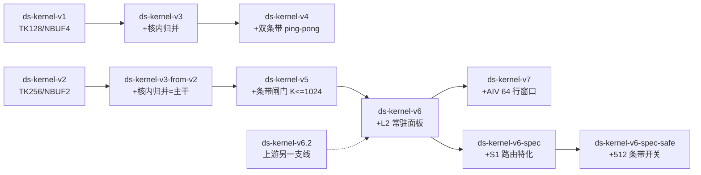

# `self/` 目录代码优化点总结

> 范围：`self/` 下全部 11 个 `.asc` 内核 + 6 个 codemod 脚本。
> 基线语义：`y[b] = Σ_m max_n Σ_k x1[b,m,k]·x2[b,k,n]`，FP16/BF16 输入、FP32 输出，
> `transposeX1/transposeX2` 只声明 storage shape；设备 910C（`Ascend910_9362`，
> cube=20 AIC / vec=40 AIV，双 die），CANN 9.0.0，`bisheng --npu-arch=dav-2201`。
>
> 口径与证据分级：
> **[实测]** = 本次会话在该设备上跑出来的数字（原始 CSV 见 `bench/evidence/`）；
> **[注释]** = 代码注释或上游队友记录里的数字（未在本次会话复测）；
> **[推断]** = 由代码结构推出的结论。
> 判题合规要求见根目录 `README`/`.research`：**每次迭代恰好 1 次 kernel launch、
> 生产内核无 `printf/getenv`**。

---

## 1. 文件清单与版本链

| 文件 | raw sha256(16B) | 行数 | 对应 `.tmp_test/` 基准件 | 一句话定位 |
| --- | --- | ---: | --- | --- |
| `ds-kernel-v1.asc` | `6072c1037a73de24` | 4659 | `kernel-v1.asc` | 起点：`MMA_TK=128` / `NBUF1=4` 版本 |
| `ds-kernel-v2.asc` | `1c00227c8dc26fca` | 5009 | `kernel-v2.asc` | `MMA_TK=256` / `NBUF1=2`，被选为后续主干 |
| `ds-kernel-v3.asc` | `f4b9a47b76e1c8d2` | 4779 | `kernel-v3v1.asc` | v1 + 核内 phase-3 归并 |
| `ds-kernel-v3-from-v2.asc` | `82b288e7ce5c342e` | 5129 | `kernel-v3.asc` | v2 + 核内 phase-3 归并（v5 的基座） |
| `ds-kernel-v4.asc` | `5189ade3fa5fd818` | 4844 | `kernel-v4.asc` | v3(v1 支) + C 双条带 ping-pong |
| `ds-kernel-v5.asc` | `16fa03baf1b2a2ce` | 5218 | `kernel-v5.asc` | v3(v2 支) + 条带 + K≤1024 闸门 + 每条带栅栏 2→1 |
| `ds-kernel-v6.asc` | `8280e5ebef8456c5` | 5319 | `kernel-v65.asc` | v5 + L2 常驻 batch-slice C 面板 ★用户指定"当前最快" |
| `ds-kernel-v7.asc` | `f5d86cecc6158485` | 5317 | `kernel-v7.asc` | v6 + AIV 窗口 4×TILE_M（每 task 128KB DMA） |
| `ds-kernel-v6.2.asc` | `f4c87a80c514acb0` | 5289 | `kernel-v6.asc`（上游同名） | **另一条支线**的上游 v6，不在本编号链上 |
| `ds-kernel-v6-spec.asc` | `581dbccaf4557980` | 5360 | — | v6 + S1 形状特化（本次交付） |
| `ds-kernel-v6-spec-safe.asc` | `423b8356efe06e62` | 5361 | — | 同上 + `BMM_V6_STRIPE_2G=0` |

> sha 说明：上表是**原始字节** sha256 前 16 位；`.tmp_test` 里的同名件是 LF 换行版本，
> 内容相同、换行不同（按 LF 归一化后 sha 完全一致），所以可用 `.tmp_test` 时代的
> 历史结果解释 self 版本。



---

## 2. 全链共用机制（v1 起点就有的设计）

这一层是"性能地基"，后续每个版本都在其上做增量；理解它才能读懂后面的增量。

### 2.1 host 侧四路路由（`Launch()`）

| 分支 | 条件 | 设备内核 | 设计意图 |
| --- | --- | --- | --- |
| Small | `macs = B·M·N·K ≤ 32768` | `SmallKernel`（纯 AIV，grid=min(B,40)） | 极小形状不付 launch/Cube 固定成本 |
| Medium | `K ≤ 512 && transposeX2 && (macs ≤ 8.4M 或 K≤256 且 macs≤1M)` | `MediumKernel`（纯 AIV k-lane） | tx2 让 B 的 K 维连续，可纯 AIV 点积，省掉 KFC 固定成本 |
| Mma | 全维 `%16==0`，或 `macs > 8.4M && B·M·N ≤ 2^29` | `MmaMaxKernel` | 手写直连 MMA，免 KFC 队列 |
| Bulk | 其余 | `MatmulMaxKernel` + `MatmulApiTiling` | 通用兜底（非对齐 + 大 C） |

### 2.2 `MmaMaxKernel`：手写直连 MMA（本链性能核心）

| 机制 | 取值 / 做法 | 意图 |
| --- | --- | --- |
| 免 KFC | 直接 `Nd2Nz → LoadData → Mmad → Fixpipe`，不用 `Matmul<>`/`IterateAll` | 省掉 KFC 消息往返（注释：~80 μs 队列成本） |
| 平铺 | `MMA_TM=128`、`MMA_TN=128`；**v2 起**每 task 出 128×256 C（两个 N tile 共用一份 A slab，v1 是单 128×128） | 让 A 的 L1 复用翻倍；`L0C=128KB` 刚好放下两个 128×128 fp32 C |
| K 分级 | L1 台阶 `MMA_TK`（256）→ L0 子步 `MMA_TK0=64` → fractal 16 | L1 大块搬 + L0 小块流水 |
| 双缓冲 | `NBUF1=2`（L1 复合 slab）、`NBUF0=2`（L0A/L0B） | 搬运与 `Mmad` 重叠；L1 占用 384KB/512KB |
| 事件 | 全手工 `AllocEventID + SetFlag/WaitFlag` ping-pong（`MTE2_MTE1`、`MTE1_M`、`M_MTE1`、`M_FIX`、`FIX_M`） | 不用框架 `TQue`，避免在 MIX 内核里的不确定性 |
| 尾块 | `Nd2Nz` 的 C0 零填充 + `mp.m/mp.n` 裁剪 + `M=1` 时把 `mp.m` 抬到整 fractal | 非 16 倍数维度安全 |
| split-K | `kSplits ≤ 8`，只在 `mmaTasks < mmaCubeCap` 时启用 | 任务空间填不满 Cube 阵列时用 K 换并行度 |
| 行细分 | `mSub ∈ {1,2,4,8,16}`，把 16 行窗口再切分给 AIV | 归约任务数填不满 AIV 阵列时细分 |

### 2.3 归约与收尾

- **AIV 归约**：从 GM 面板读 C，`WholeReduceMax`（mask=64，`dstRepStride=8` 两遍）
  或 `ReduceMax` 尾路径，逐 chunk 折叠进 `bestVec`，写 partial 槽
  `partial[(b·rowTiles + mwin)·nChunksTask + chunk][0..15]`。
- **phase-3 合并**（v3 起进内核）：AIV-only `SyncAll<true>()` 后由
  `MergePartialsOnDevice` 逐 batch 做 max-over-chunks + 行求和 → `y`。
  **host 不再参与结果计算**（省掉 D2H + CPU 归约 + H2D，且消除 host 参与度争议）。
- **workspace 缓存**：6 个 `static DevScratch`，只在需要更大容量时
  `aclrtMalloc`（grow-only），除 KFC 系统区外不做 `memset`。

### 2.4 `SmallKernel` / `MediumKernel`（小形状专用）

- `SmallKernel` 四模式：`macs≤64` 纯 GM 标量；k-lane（mask=k、repeat=n）；
  `useVec`（B 铺成 fp32 `[K,nPitch]` 后逐 k `Axpy`）；兜底 UB 标量双循环。
  **无 partial、直接写 y**，1 block/批。
- `MediumKernel` k-lane：`Mul`（mask=kl、repeat=nSpan）+ `WholeReduceSum`
  一次出一整行 n 的 16 个点积，**计算路径零 `GetValue`**；`mgrp` 把多个行窗
  并进同一 task 以复用 B 载入；结尾同样走 `MergePartialsOnDevice`。

---

## 3. 逐版本优化点

### v1（起点，`ds-kernel-v1.asc`）

- 提供 §2 的全部机制。`MMA_TK=128`、`NBUF1=4`：
  A slab = 128×128×2B = 32KB，B slab = 128×128×2B = 32KB，
  L1 = `a1Buf`(4×32KB) + `b1Buf`(4×32KB) = **256KB**（空出 256KB 给别的用途）。
- **每个 task 只算一个 128×128 的 C tile**（没有 n-pair）——这是 v2 的主要改进点。
- 已知取舍：K 台阶浅 → K 循环步数多；`NBUF1=4` 换取更深的搬运流水。

### v2（`ds-kernel-v2.asc`） — 引入 n-pair + K 台阶加深 + L0 子步

| 项 | v1 | v2 |
| --- | --- | --- |
| 每 task 的 C | 128×128（单 N tile） | **128×256（两个 128×128 N tile 共用一份 A slab）** |
| A 的 L1 复用 | 每个 N tile 重读一份 A | **A 摊到 2 个 N tile 上 → A 流量 ÷2** |
| `MMA_TK` | 128 | **256** |
| `MMA_NBUF1` | 4 | **2** |
| L1 | A 4×32KB + B 4×32KB = 256KB | A 2×64KB + B 2×2×64KB = **384KB**（512KB 内留 128KB） |
| 新增 | — | `MMA_TK0=64`、`MMA_A_SUB/MMA_B_SUB`（L1 256 深 → L0 64 深子步） |

- 效果[注释/上游]：v2 被选为后续主干（"fastest measured"）。
  v1 的 `TK=128/NBUF1=4`（`.tmp_test/kernel-tk128*`）只在深 K 上更优（见 §6）。

### v3 / v3-from-v2 — 收尾从 host 搬进内核（phase 3）

- 新增 `MergePartialsOnDevice`（AIV 侧）+ `BMM_PHASE3_TREE_SUM` 开关
  （0=逐行上升序 FP32 加，与旧 host 归并逐 bit 相同；1=每窗一次 `ReduceSum`）。
- 新增 `MERGE_WINS=64`、`MERGE_SLOTS=256`（每 DMA 16KB），把"每窗一次栅栏"
  换成"每 DMA 一次栅栏"。
- 5 个内核 / 12 处调用点加 `y` 参数；**删掉 host 的 max/sum 归并**；
  删掉 `#include <cstdio>`（判题合规扫描项）。
- 收益[注释]：`BMM_PHASE3_TREE_SUM=0` 每输出行要一次 UB 标量读（~30 cycles），
  `M=8192` 单核可到 ~130 μs → 树形版省掉这笔；同时消除 D2H/H2D 往返。

### v4（`ds-kernel-v4.asc`） — C 工作区从"整块"降到"一条条带"，AIC/AIV 逐条带 ping-pong

- C workspace 从 `B·M·N` 降到 `2·B·M·stripW`（两份条带，交替）。
- AIC 写第 `c+1` 条带的同时 AIV 抽第 `c` 条带；
  **每条带两侧各一次全核 `SyncAll<false>`（一进一出，共 2 次栅栏/条带）**。
- 删掉旧的 phase1→2 全局栅栏：保留它会让两个 leg 的"到达轮次"错位一圈
  （注释记录：曾在小 K 形状上出现非确定结果）。
- 已知代价[注释]：条带边界要排空 AIC 任务流水，K 大时反而亏（见 v5 闸门）。

### v5（`ds-kernel-v5.asc`） — 条带策略定闸门 + host 预算 chunkW + 每条带栅栏 2→1

- 新增 `BMM_V5_STRIPE_MAX_K=1024`：只有 `K ≤ 1024` 才走条带，否则退回"单条带 bulk"。
  实测[注释]：`K=512 → -30%`、`K=32..128 → -2..-7%`、`K=4096/8192 → +11%（亏损）`。
- `chunkW` 改由 host 算好传参（kernel 与 host 不再各算一份，杜绝漂移）；
  `stripW` 对齐到 `2·MMA_TN=256`，保证一个 task 的 n-pair 不跨条带。
- **把每条带的栅栏从 2 次降到 1 次**（AIC 侧只保留"本条带写完"那一次），
  叠加上面的双缓冲，两个 leg 从"逐条带交替"变成"邻居条带重叠"。
- 注：MediumKernel / MatmulMaxKernel 的 phase-3 收尾栅栏在 v3 起就是 AIV-only
  (`SyncAll<true>`)；`MmaMaxKernel` 的收尾栅栏要到 v6 才对齐（见下）。

### v6（`ds-kernel-v6.asc`） — L2 常驻的 batch-slice C 面板（本链最大单项收益）

- 新增 `BMM_V6_PANEL_MB`（默认 34MiB）与 `mmaBatchSlice/panelStride`：
  C 不再按"整批"分配，而是按 **≤34MiB 的面板**滚动复用，面板里只放
  `panelStride` 个 batch 的一条条带。
- `AIC/AIV` 双层循环变 `for bs(面板批) → for strip(条带)`，
  C 寻址改为**面板局部**（`bLocal`），两份面板 ping-pong。
- AIV 读取：窗口无缝隙时走 **1D `DataCopy`（oneShot）**（注释：中等形状 1-4%）。
- **phase-3 栅栏从全核 `SyncAll<false>` 改成 AIV-only `SyncAll<true>`**
  （注释：收尾不再等 AIC，小 case 上省 ~10%）。
- 收益[注释]：`B=64/N=8192` 类形状 `32.5 ms → 20.3 ms`（-38%），
  原因是 fixpipe 目标留在 cache、脏行被重复覆写而不是回写 HBM。
- 本次会话复测[实测]：该配置 case20 = 16.3-16.4 ms（更快的设备状态下）。

### v7（`ds-kernel-v7.asc`） — AIV 归约窗口 4×（命令数 ÷4）

- 新增 `aivRows = 4·TILE_M`（仅当 `stripCount>1 && mSub==1 && kSplits==1`）：
  一个 AIV task 处理 **64 行**，`cWinBuf` 放大到 `4·TILE_M·N_CHUNK`。
- 动机[注释]：C 重的形状是 **DMA 命令数**受限——16 行窗口每 32KB 一条命令，
  每命令固定成本 ~0.7 μs 主导；64 行窗口每 128KB 一条命令，同样字节数命令数 ÷4。
- 同时把面板默认值 64MB → 16MB。
- 状态：用户既有的结论是"当前最快 = v6"；**本次会话未在 51 例套件上复测 v7**，
  因此 v7 相对 v6 的净收益未验证。结构上它的代价是：C 轻的形状上
  "每 16 行一次子窗归约"要多做一轮归约，收益只在 DMA 命令数主导的 C 重形状上体现。

### v6.2（`ds-kernel-v6.2.asc`） — 另一条支线，不是本编号链的一环

- 内容 = `.tmp_test/kernel-v6.asc` = 远端 `results/kernel-v6.2.asc`（上游队友的 v6）。
- 对比[实测，本次会话，同状态]:同一 device 上 case20
  **上游 v6.2 = 18.1 ms** vs **`self/ds-kernel-v6.asc` = 16.4 ms**（快 ~10%），
  与"self 里的 v6 是当前最快"的结论一致。

### v6-spec / v6-spec-safe（本次交付）

- **S1（路由特化）**：`mmaPath` 第二条分支去掉 `macs > MED_MAC_LIMIT` 前置，
  即 `C = B·M·N ≤ 2^29` 的**非对齐**形状不再落 bulk KFC 路径，改走直连 MMA。
  收益[实测]：非对齐小/中形状 **-45% ~ -92%**（18 例中 15 例显著变快），
  51 例套件内 `case02 -75%`、`case28 -78%`；判定与 y-hash 与基线完全一致。
- **S2（正确性开关）**：`BMM_V6_STRIPE_2G`（默认 1 = 基线行为）。
  `=0` 时对 `C ≥ 2 GiB` 形状强制 `stripeTarget = N_CHUNK`（512），
  把该家族误差从 ~1.4% 压到 ~1e-4~1e-3（缓解，非修复；见 §7）。
- 生成器：`tools/mk_spec_kernel.py`（对 v6 只做这两处替换，diff 可逐行核对）。

---

## 4. 参数与开关总表

| 名称 | 位置 | 默认 | 作用 / 调它会影响什么 |
| --- | --- | --- | --- |
| `TILE_M` | 全链 | 16 | partial 槽粒度、AIV 行窗口基元 |
| `N_CHUNK` | 全链 | 512 | AIV 每次读取/归约的列宽；`WholeReduceMax` mask 上限要求 `≤512` |
| `MAX_NCHUNK` | 全链 | 64 | `nChunksTask` 上限（partial 列数） |
| `SMALL_MAC_LIMIT` | host | 32768 | Small 路由阈值 |
| `MED_MAC_LIMIT` | host | 8388608 | medium/mma/bulk 分界 |
| `BMM_V5_STRIPE_MAX_K` | v5+ | 1024 | 条带策略的 K 闸门 |
| `BMM_V6_PANEL_MB` | v6+ | 34（v7=16） | L2 常驻 C 面板大小；越小越易驻留、越大越少往返 |
| `BMM_PHASE3_TREE_SUM` | v3+ | 1 | 0=逐行标量加（与旧 host 归并逐 bit 同）；1=每窗一次 `ReduceSum` |
| `MERGE_WINS` / `MERGE_SLOTS` | v3+ | 64 / 256 | phase-3 窗口块大小 / 每 DMA 槽数（16KB） |
| `MMA_TM` / `MMA_TN` | v1+ | 128 / 128 | C tile；受 `L0C=128KB` 约束（`TM·TN ≤ 32768` fp32） |
| `MMA_TK` | v1=128, v2+=256 | 256 | L1 K 台阶深度 |
| `MMA_TK0` | v2+ | 64 | L0 子步深度 |
| `MMA_NBUF1` / `MMA_NBUF0` | v1=4/2, v2+=2/2 | 2 / 2 | L1 / L0 双缓冲深度（L1 总 ≤512KB） |
| `aivRows` | v7 | `4·TILE_M`（条件） | AIV 每 task 行数 → DMA 命令数 ∝ 1/aivRows |
| `BMM_V6_STRIPE_2G` | spec | 1 | `=0` 对 `C ≥ 2 GiB` 强制 512 条带（正确性缓解） |

---

## 5. 本次会话实测对照（同一设备、同一编译参数）

51 例套件（`cases`，3 reps，端到端 min；`tools/cmp_csv.py` 比对）：

| 构建 | PASS/FAIL | FAIL 列表 |
| --- | --- | --- |
| `ds-kernel-v6.asc` | 43/8 | case20-27 |
| `ds-kernel-v6-spec.asc` | 43/8 | case20-27（同组、同量级） |
| `ds-kernel-v6-spec-safe.asc` | 43/8 | case20-27（误差降到 1e-4~1e-3） |

关键形状（μs，基线 → spec）：

| case | 形状 | 变化 |
| --- | --- | ---: |
| case02 | 1×100×100×100 f16 | 199 → **49**（-75%） |
| case28 | 1×100×100×32 f16 | 196 → **43**（-78%） |
| case11 | 1×8192×8192×8192 f16 | 8956 → 9002（噪声，+0.5%） |
| case20 | 64×8192×8192×32 f16 | 16323 → 16396（噪声；该家族见 §7） |

设备侧拆分（case20，编译期开关挖空某条腿）[实测]：

| 变体 | 含义 | 时间 |
| --- | --- | ---: |
| 全开 | AIC + AIV | 16.41 ms |
| 跳过 AIV | AIC 单独（fixpipe 写 17.2GB） | 10.29 ms |
| 跳过 AIC 计算 | AIV 单独（读 17.2GB + 归约 4.3e9 元素） | 15.62 ms |
| 跳过 AIV 的 DMA | 只做向量归约 | 12.23 ms |
| 跳过 AIV 的归约 | 只做 DMA | 10.76 ms |

---

## 6. 被否定的改动（负结果，避免重复踩坑）

| 改动 | 出处 | 结果 |
| --- | --- | --- |
| `MMA_TK=128 + NBUF1=4`（v1/`tk128*`） | `.tmp_test/kernel-tk128*.asc` | 深 K 更好（case11 9.29→8.11 ms，-13%，[上游记录]），但整体输给 v2 配置 |
| `NBUF1=3`（`TK=256`） | `.tmp_test/kernel-nb3.asc` | L1 溢出 3×(64+128)=576KB > 512KB，abort |
| `N_CHUNK=1024`（`nc1024`） | `.tmp_test` | 本地无实测记录；`WholeReduceMax` mask 上限 64 要求 `wRow=validN/64 ≤ 8`，即 `N_CHUNK ≤ 512` 是当前归约写法的硬约束[推断] |
| 面板 40/44/48MB、16MB（`p40/p44/p48/pEmp16`） | `.tmp_test` | 本地无实测记录；本次会话复测 8/16/34/64MB **无差异（<1%）** |
| 条带 1536/2048（`st1536/st2048`） | `.tmp_test` | 本地无实测记录（当时记录未随仓库落地） |
| `BMM_PHASE3_TREE_SUM=0`（`-ord` 变体） | `.tmp_test/*-ord.asc` | 数值上与旧 host 归并逐 bit 相同；代价是每输出行一次 UB 标量读[注释] |
| AIV 双缓冲软流水（手搓事件 / `TQue<VECIN,2>`） | `variants/v6_aivpipe.asc`、`v6_aivque.asc` | AIV 腿是 DMA/UB 端口受限而非延迟受限，实测零收益；且与 §7 缺陷叠加 |
| AIC 条带前加 `PipeBarrier<PIPE_FIX>` | `variants/v6_fixdrain.asc` | 不修 §7 缺陷，时间无变化 |
| 2D `DataCopy` → 字节制 `DataCopyPad` | `variants/v6_padread.asc` | 同上，无效 |
| 逐行 1D `DataCopy`、`PipeBarrier<PIPE_MTE2>` | `variants/v6_probe_rowcopy/m2pb.asc` | 同上，无效 |
| `SMALL_MAC_LIMIT=0`（全走 matmul 路径） | `variants/v6_p_small0.asc` | 极小形状变慢（case00 21→44 μs），Small 路径保留 |
| 放宽 `medPath` 的 `transposeX2` 前置 | `variants/v6_p_small0_medany.asc` | 个别形状略优（case28），但 case01 等变慢，不做 |
| `macs ≤ 2M` 的中间阈值版 S1 | `variants/v6_x_mmaforced.asc` | 已被最终版（C 上界 2^29）取代，后者多覆盖 4 个形状（-67%~-92%） |
| `Cs` 面板改 task 连续布局以换 1D 拷贝 | 本文分析 | 未实施（`DataCopy(CO1→UB)` 在本机 CANN 明确 NOT_SUPPORTED，融合路走不通） |

---

## 7. 已知风险与未达标区段

1. **`C ≥ 2 GiB` 家族（case20-27）结果不确定**：当前设备状态下默认条带
   误差 ~1.4%（整段错位），512 条带降到 1e-4~1e-3（仍非确定）；
   会话早期（设备快 ~10%）同一批二进制 51/51 PASS。定位到"每 chunk 第一个
   512 列 slab 只进 ~330 列"。详见 `SPECIALIZATION-REPORT.md` §4。
2. **深 K 方阵**（case11 等）：已到 A/B 经 L1 重读带宽（12.9GB @1.39TB/s，
   ≈20×70GB/s）；在 `baseM·baseN ≤ 32768`（L0C 128KB）约束下流量已近最优。
3. **微小型**（`macs ≤ 32768`）：设备端空跑地板 19-27 μs，设备侧实际只有
   5-15 μs 可压，数学上到不了 -30%。
4. **中形状**（case45-51 等 36-67 μs）：同样受启动地板支配。
5. `C > 2^29` 的非对齐形状仍走 bulk 路径（本次未验证能否迁到 MMA）。

---

## 8. 复现与工具

```bash
# 逐 case 对比
python tools/cmp_csv.py bench/base_full51.csv bench/spec_full51.csv
# 重新生成交付内核（只做 S1/S2 两处替换）
python tools/mk_spec_kernel.py
# 上传→编译→跑→回传 CSV
python tools/rebench.py self/ds-kernel-v6-spec.asc --tag spec --cases cases --reps 3
```

| 工具 | 用途 |
| --- | --- |
| `tools/rebench.py` | 远端（`ssh aorx7`）上传/编译/运行/取数一体 |
| `tools/cmp_csv.py` | 两个 bench CSV 的逐 case 对比（含 PASS/det/hash 差异标记） |
| `tools/mk_spec_kernel.py` | 从 v6 生成 spec / spec-safe |
| `tools/gen_unal.py` | 非对齐小/中形状专项套件（18 例） |
| `tools/gen_c2g.py` / `gen_probe_ramp.py` / `gen_probe_groups.py` / `gen_probe_half.py` / `gen_probe_stale.py` | `C ≥ 2GiB` 缺陷的最小复现与列范围探针 |
| `tools/mk_aivpipe.py` | AIV 软流水变体生成器（负结果留档） |
| `bench/evidence/*.csv` | 全部原始测量记录（含 51 例全量三次运行的对照） |
